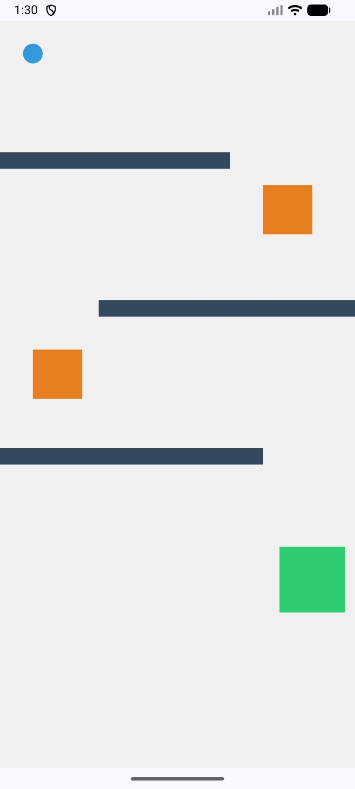

# AshishAssignment4_Q1

# Gyroscope Maze Ball Game (Android - Jetpack Compose)

This is an Android game built using **Jetpack Compose** where a ball is controlled using the **gyroscope sensor** of the device.

The goal is simple:
 Tilt your phone to move the ball  
 Avoid traps and walls  
 Reach the green goal area  

---

## Gameplay

- The ball moves based on **device tilt (gyroscope)**
- You must navigate through a maze
- There are:
  - 🟦 Walls (block movement)
  - 🟧 Traps (reset or game over)
  - 🟩 Goal (win condition)

---

## Screenshot

---

## Features

- Gyroscope-based movement
- Real-time physics (velocity + friction)
- Collision detection:
  - Walls
  - Traps
  - Goal
- Smooth game loop using `LaunchedEffect`
- Restart system after win/lose
- Clean UI built with Jetpack Compose

---

## How It Works (Simple)

- Gyroscope gives tilt values → converted into velocity
- Velocity updates ball position
- Collision is checked using `Rect.overlaps()`
- If:
  - hits wall → bounce back
  - hits trap → reset / game over
  - reaches goal → win

---

## Main Files

- `MainActivity.kt` → Entry point + basic game
- `BallGame.kt` → Advanced version with better UI and effects

---

## Important Concepts Used

- Jetpack Compose (`Canvas`, `Box`, `State`)
- Sensors (`SensorManager`, `Gyroscope`)
- Game loop using coroutines (`delay(16)`)
- Collision detection using rectangles

---

## How to Run

1. Open project in Android Studio
2. Connect a real device (gyroscope required)
3. Run the app
4. Tilt device to play

---

## Notes

- Emulator may not support gyroscope properly
- Best experience on a real phone

---

## Future Improvements

- Add levels
- Add score system
- Add sound effects
- Add difficulty modes

---

## 🤖 AI Usage

Some AI assistance (ChatGPT) was used during this project for:
- Debugging small errors
- Reviewing code behavior
- Improving README formatting and structure

However, the **core game logic, implementation, and design were fully developed by me**.

---

## Author

Ashish Joshi
Boston University
